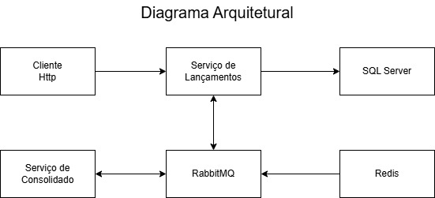

# Documentação da Solução

Este documento descreve a arquitetura e o funcionamento do sistema de controle de fluxo de caixa, composto por dois serviços principais: **Serviço de Lançamentos** e **Serviço de Consolidado**.

---

## Diagrama Arquitetural

Abaixo está o diagrama que ilustra a arquitetura do sistema:



## Descrição dos Componentes

### 1. Serviço de Lançamentos
- **Responsabilidade**: Recebe requisições HTTP para adicionar lançamentos (débitos e créditos).
- **Funcionalidades**:
  - Persiste os lançamentos no banco de dados SQL Server.
  - Publica eventos no RabbitMQ para notificar o serviço de consolidado.
- **Endpoints**:
  - `POST /api/lancamentos`: Adiciona um novo lançamento.
  - `GET /api/lancamentos`: Retorna a lista de lançamentos (para debug ou auditoria).

### 2. Serviço de Consolidado
- **Responsabilidade**: Calcula e armazena o saldo consolidado diário.
- **Funcionalidades**:
  - Consome eventos de lançamentos do RabbitMQ.
  - Calcula o saldo consolidado e o armazena no Redis.
  - Expõe um endpoint REST para consultar o saldo consolidado.
- **Endpoints**:
  - `GET /api/consolidado`: Retorna o saldo consolidado do dia.

### 3. Banco de Dados (SQL Server)
- **Responsabilidade**: Armazena os lançamentos (débitos e créditos).
- **Tabelas**:
  - `Lancamentos`: Armazena os lançamentos.
  - `Consolidado`: Armazena o saldo consolidado (opcional, se persistência for necessária).

### 4. Redis
- **Responsabilidade**: Armazena o saldo consolidado em cache para consultas rápidas.
- **Chave**: `saldo_consolidado`.

### 5. RabbitMQ
- **Responsabilidade**: Facilita a comunicação assíncrona entre o serviço de lançamentos e o serviço de consolidado.
- **Filas**:
  - `lancamentos`: Fila onde os eventos de lançamentos são publicados.

---

## Fluxo de Funcionamento

1. **Adição de Lançamentos**:
   - O cliente envia uma requisição HTTP para o **Serviço de Lançamentos**.
   - O **Serviço de Lançamentos** persiste o lançamento no **SQL Server**.
   - O **Serviço de Lançamentos** publica um evento no **RabbitMQ**.

2. **Processamento de Lançamentos**:
   - O **Serviço de Consolidado** consome o evento do **RabbitMQ**.
   - O **Serviço de Consolidado** recalcula o saldo consolidado e o armazena no **Redis**.

3. **Consulta do Saldo Consolidado**:
   - O cliente envia uma requisição HTTP para o **Serviço de Consolidado**.
   - O **Serviço de Consolidado** retorna o saldo consolidado armazenado no **Redis**.

---

## Tecnologias Utilizadas

- **Linguagem de Programação**: C# (.NET 8)
- **Banco de Dados**: SQL Server
- **Cache**: Redis
- **Mensageria**: RabbitMQ
- **Containerização**: Docker
- **Orquestração**: Docker Compose

---

## Configuração do Ambiente

### Pré-requisitos
- Docker e Docker Compose instalados.
- .NET 8 SDK (para desenvolvimento local).

### Passos para Executar o Projeto

1. **Clone o Repositório**:
   ```bash
   git clone https://github.com/seu-usuario/fluxo-caixa.git
   cd fluxo-caixa```

2. **Suba os Containers**:

   ```docker-compose up -d```
3. ** Acesse os Serviços**:
- Serviço de Lançamentos: http://localhost:5000/swagger/index.html
- Serviço de Consolidado: http://localhost:5001/swagger/index.html
- RabbitMQ Management: http://localhost:15672 (usuário: guest, senha: guest)

4. **Teste os Endpoints**:
```curl -X POST http://localhost:5000/api/lancamentos -H "Content-Type: application/json" -d '{"tipo": "Crédito", "valor": 1000.00, "descricao": "Venda de produto"}'```
```curl http://localhost:5001/api/consolidado```
## Evoluções Futuras

### Autenticação e Autorização:
- Adicionar autenticação JWT para proteger os endpoints.

### Monitoramento:
- Implementar métricas e logs centralizados (ex: Prometheus + Grafana).

### Escalabilidade:
- Configurar autoscaling para os serviços em um ambiente de nuvem.

### Persistência do Consolidado:
- Armazenar o saldo consolidado no banco de dados para histórico e recuperação em caso de falha.


